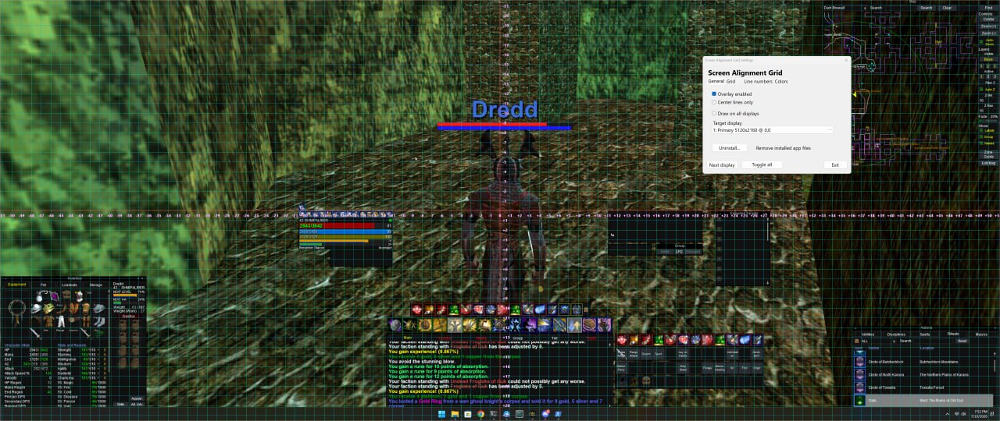

# Screen Alignment Grid

A small Windows overlay utility for aligning games, apps, and desktop layouts UI pieces.

It draws a transparent, click-through, always-on-top grid over one selected monitor by default, with strong vertical and horizontal center lines. You can also toggle all-monitor mode.

## Screenshot



Example view with the overlay enabled, center axes and numbered grid lines visible, and the settings window open over a game running in windowed/borderless mode.

## Files

- `ScreenAlignmentGrid.ps1` — the actual tool.
- `Run Screen Alignment Grid.cmd` — double-click launcher.
- `Launch Screen Alignment Grid.vbs` — invisible launcher used by installed shortcuts so no console/taskbar command window appears.
- `Install Screen Alignment Grid.cmd` — installs the tool for the current Windows user and creates Desktop and Start Menu launch shortcuts.
- `Create Desktop Shortcut.cmd` — creates a **Screen Alignment Grid** shortcut on your Windows desktop.
- `assets/ScreenAlignmentGrid.ico` — custom app icon.

## How to run

1. Extract the zip.
2. Recommended: double-click `Install Screen Alignment Grid.cmd`.
   - Installs to `%LOCALAPPDATA%\Programs\Screen Alignment Grid`.
   - Creates Desktop and Start Menu launch shortcuts using the custom icon.
   - Removes any old Start Menu uninstall shortcut from previous versions; uninstall is available from the app's **General** tab.
3. Portable mode: double-click `Run Screen Alignment Grid.cmd` directly from the extracted folder.
4. Optional portable shortcut only: double-click `Create Desktop Shortcut.cmd` to add a **Screen Alignment Grid** shortcut to your Windows desktop.
5. If Windows SmartScreen or PowerShell execution policy complains, right-click the `.ps1`, choose Properties, click Unblock if present, then run the `.cmd` again.

You can also run it manually from PowerShell:

```powershell
powershell.exe -NoProfile -ExecutionPolicy Bypass -File .\ScreenAlignmentGrid.ps1
```

## Hotkeys

| Hotkey | Action |
|---|---|
| `Ctrl + Alt + G` | Toggle overlay on/off |
| `Ctrl + Alt + S` | Open settings window |
| `Ctrl + Alt + C` | Toggle center-lines-only mode |
| `Ctrl + Alt + Plus` | Increase grid spacing |
| `Ctrl + Alt + Minus` | Decrease grid spacing |
| `Ctrl + Alt + Up` | Increase grid intensity |
| `Ctrl + Alt + Down` | Decrease grid intensity |
| `Ctrl + Alt + M` | Cycle the overlay to the next display |
| `Ctrl + Alt + A` | Toggle all-displays mode |
| `Ctrl + Alt + N` | Toggle +/- axis number labels |
| `Ctrl + Alt + Esc` | Exit |

There is also a small tray icon named **Screen Alignment Grid** with toggle, settings, and exit options.

## Settings window

The settings window opens automatically when the tool starts. You can also reopen it with `Ctrl + Alt + S` or from the tray menu. It uses a tabbed layout with larger text for high-DPI displays.

It lets you change:

- Overlay enabled/disabled.
- Center-lines-only mode.
- +/- axis line-number labels. These show grid-line counts from center, such as `-2`, `-1`, `0`, `+1`, `+2`, directly on the center axes.
- Single-display target.
- All-displays mode.
- Grid spacing.
- Grid intensity.
- Locked colorblind-friendly color presets.
- Custom-only color buttons for thin grid lines, major grid lines, center lines, and line-number text.
- Line-number size, color, and offset from the center axes.
- Uninstall option on the **General** tab, with confirmation.

## Recommended game mode

Use the target game/app in **windowed** or **borderless fullscreen** mode.

Normal Windows overlays may not appear over true exclusive fullscreen games/apps. If you do not see the grid, switch the target app to borderless/windowed mode first.

## Safety / behavior

- Does not read game memory.
- Does not inject into the game.
- Does not automate clicks or keystrokes in the game.
- The overlay is click-through, so it should not block your UI dragging.
- It only draws guide lines on top of the screen.

## License

MIT License. See [`LICENSE`](LICENSE).

## Notes

### Version notes

- `2026-07-08 v27`: Shortened the General tab uninstall description to `Remove installed app files` to avoid clipping on high-DPI displays.
- `2026-07-08 v26`: Fixed high-DPI clipping on the General tab uninstall description by shortening the text and increasing the label height.
- `2026-07-08 v25`: Fixed settings UI not appearing after hidden launch on some Windows systems. The app now explicitly restores, shows, activates, and brings the settings window forward after creation, even when launched through the invisible VBS/wscript path.
- `2026-07-08 v24`: Moved uninstall access into the app UI. Added an **Uninstall...** button on the General tab with confirmation, removed the Start Menu uninstall shortcut from new installs, and made the installer delete any old Start Menu uninstall shortcut created by earlier versions.
- `2026-07-08 v23`: Fixed installed/desktop shortcut launch so PowerShell no longer appears on the taskbar. Shortcuts now target `wscript.exe`, which runs `Launch Screen Alignment Grid.vbs`; the VBS starts PowerShell hidden with window style `0`, keeping only the overlay/settings UI visible.
- `2026-07-08 v22`: Added a current-user installer (`Install Screen Alignment Grid.cmd` / `.ps1`) that installs the app under `%LOCALAPPDATA%\Programs\Screen Alignment Grid`, creates Desktop and Start Menu shortcuts, adds an uninstall shortcut, and uses a new custom Screen Alignment Grid icon.
- `2026-07-08 v21`: Updated the desktop shortcut creator so the generated desktop shortcut launches PowerShell with `-WindowStyle Hidden`, avoiding a visible console window while still showing the overlay/settings UI.
- `2026-07-08 v20`: Fixed desktop shortcut creation. `Create Desktop Shortcut.cmd` now creates/replaces the desktop shortcut to launch `powershell.exe` directly with `ScreenAlignmentGrid.ps1`, instead of routing through `cmd.exe` and the launcher batch file.
- `2026-07-08 v19`: Default grid intensity now starts at max (`200`) so users get the clearest colors immediately and can lower intensity if desired. Added `Create Desktop Shortcut.cmd`, which creates a **Screen Alignment Grid** launcher shortcut on the current user's Windows desktop.
- `2026-07-08 v18`: Fixed low-opacity color hue shifting by replacing semi-transparent line drawing with hue-safe intensity scaling. Lines are now drawn fully opaque after their RGB values are dimmed, so white/yellow no longer blend with the magenta transparency key and turn purple/orange at default intensity. The Grid tab now labels this control as **Grid intensity**.
- `2026-07-08 v17`: Restored the pre-v14 opacity behavior while keeping the locked preset/custom color-selection fixes. Thin grid opacity defaults back to 100, center line opacity defaults back to 230, grid opacity max is back to 200, major/border/text alpha caps are back to the earlier softer values, and the Grid tab label is back to **Grid opacity**.
- `2026-07-08 v16`: Locked built-in color presets so they cannot be edited accidentally. Color buttons are enabled only when **Custom** is selected. Selecting a built-in preset always reapplies that preset's default colors, while **Custom** keeps its own in-session custom color choices.
- `2026-07-08 v15`: Hardened custom color handling so switching to **Custom** does not re-run preset logic. Added a Colors-tab explanation that thin grid, major grid, center lines, and line-number text are separate layers, and added a button to copy the thin-grid color to all regular grid lines.
- `2026-07-08 v14`: Raised default grid opacity/color strength, increased max opacity to full 255 alpha, and changed the default line-number font size to 10.
- `2026-07-08 v13`: Changed the settings **Exit** button to close the whole program, not just the settings window. Added a Custom color preset state and forced color buttons to render their actual assigned colors instead of letting Windows visual styles interfere.
- `2026-07-08 v12`: Replaced the long scrolling settings window with a polished tabbed UI, removed the upper-left overlay status label so it no longer blocks screen space, and fixed line-number offset so labels stay anchored to the grid line they represent while moving only perpendicular to the center axis.
- `2026-07-08 v11`: Disabled mouse-wheel changes on sliders so scrolling the settings window near a slider does not accidentally change grid spacing, opacity, line-number size, or line-number offset.
- `2026-07-08 v10`: Fixed high-DPI settings-window clipping by enlarging the settings window, adding scrolling, increasing group-box heights, widening controls, and making color buttons taller.
- `2026-07-08 v9`: Reorganized the settings UI into grouped sections: Overlay, Display, Grid, Line numbers, and Colors. Added controls for line-number size, line-number color, and line-number offset from the center axes. Renamed color buttons to clearly describe what each color changes.
- `2026-07-08 v8`: Renamed the project to **Screen Alignment Grid** because it is a generic screen/layout alignment utility, not tied to EverQuest. Axis labels are grid-line numbers placed on the center axes, not pixel offsets.
- `2026-07-08 v7`: Settings window now opens by default, uses larger high-DPI-friendly text, removes dark background boxes behind axis labels, and changes axis labels from pixel distances to line counts.
- `2026-07-08 v6`: Expanded the settings UI with colorblind-friendly color presets and custom color buttons for grid, major grid, center lines, and axis/overlay labels.
- `2026-07-08 v5`: Added a settings window (`Ctrl + Alt + S`) with checkboxes, display picker, grid spacing slider, opacity slider, next-display button, and all-displays toggle.
- `2026-07-08 v4`: Added +/- axis number indicators along the horizontal and vertical center axes. Use `Ctrl + Alt + N` to toggle them. Positive X is right of center; negative X is left. Positive Y is below center; negative Y is above.
- `2026-07-08 v3`: Overlay now isolates to one display by default. Use `Ctrl + Alt + M` to cycle displays and `Ctrl + Alt + A` to toggle all-displays mode. Added DPI-awareness setup to reduce mixed 2K/5K scaling drift.
- `2026-07-08 v2`: Grid is now center-anchored, so the center lines always land directly on grid lines even when the screen resolution is not evenly divisible by the grid spacing.

Current future improvements worth considering:

- Save settings between launches.
- Optional startup-with-Windows toggle.
- Packaged `.exe` version.
- Signed installer/release build.
